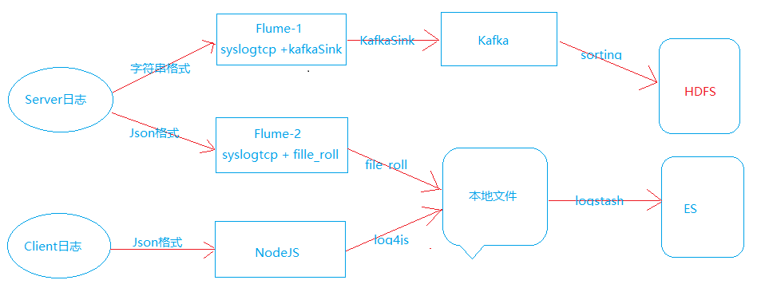
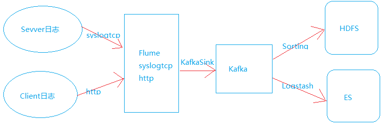

## 基于Flume+Kafka+logstash+ES的日志结构升级
### 升级前

* 服务器端日志分为两种格式：字符串格式（以'|'分隔，用来做离线分析）和Json格式（用来实时查找）。
* 客户端日志Json格式，主要用来上报用户行为（用来实时查找）；  
### 升级后

### 升级过程
1、Flume配置

	mirror_agent.sources = gamehall_source slots_opt_source http_opt_source
	mirror_agent.channels = gamehall_channel slots_opt_channel
	mirror_agent.sinks = gamehall_sinks slots_opt_sinks

	#source configuration
	mirror_agent.sources.gamehall_source.type = syslogtcp
	mirror_agent.sources.gamehall_source.host = 0.0.0.0
	mirror_agent.sources.gamehall_source.port = 20001
	mirror_agent.sources.gamehall_source.channels = gamehall_channel

	mirror_agent.sources.slots_opt_source.type = syslogtcp
	mirror_agent.sources.slots_opt_source.host = 0.0.0.0
	mirror_agent.sources.slots_opt_source.port = 20002
	mirror_agent.sources.slots_opt_source.channels = slots_opt_channel

	mirror_agent.sources.http_opt_source.type = http
	mirror_agent.sources.http_opt_source.port = 8080
	mirror_agent.sources.http_opt_source.bind = 127.0.0.1
	mirror_agent.sources.http_opt_source.handler = com.mirror.game.flume.source.MirrorHTTPSourceHandler
	mirror_agent.sources.http_opt_source.channels = slots_opt_channel

	#channel configuration
	mirror_agent.channels.gamehall_channel.type = memory
	mirror_agent.channels.gamehall_channel.capacity = 500000
	mirror_agent.channels.gamehall_channel.transactionCapacity = 100

	mirror_agent.channels.slots_opt_channel.type = memory
	mirror_agent.channels.slots_opt_channel.capacity = 100000
	mirror_agent.channels.slots_opt_channel.transactionCapacity = 50

	#sinks configuration
	mirror_agent.sinks.gamehall_sinks.channel = gamehall_channel
	mirror_agent.sinks.gamehall_sinks.type = org.apache.flume.sink.kafka.KafkaSink
	mirror_agent.sinks.gamehall_sinks.kafka.topic = slots
	mirror_agent.sinks.gamehall_sinks.kafka.bootstrap.servers = magic-mirror-1:9092
	mirror_agent.sinks.gamehall_sinks.flumeBatchSize = 100
	mirror_agent.sinks.gamehall_sinks.kafka.producer.acks = 1

	mirror_agent.sinks.slots_opt_sinks.channel = slots_opt_channel
	mirror_agent.sinks.slots_opt_sinks.type = org.apache.flume.sink.kafka.KafkaSink
	mirror_agent.sinks.slots_opt_sinks.kafka.topic = opt
	mirror_agent.sinks.slots_opt_sinks.kafka.bootstrap.servers = magic-mirror-1:9092
	mirror_agent.sinks.slots_opt_sinks.flumeBatchSize = 50
	mirror_agent.sinks.slots_opt_sinks.kafka.producer.acks = 1

2、Logstash配置
  
	input{
		kafka{
			auto_commit_interval_ms => "3000"
			auto_offset_reset => "latest"
			bootstrap_servers => ["magic-mirror-1:9092"]
			client_id => "logstash"
			group_id => "logstash"
			consumer_threads => 2
			decorate_events => true
			enable_auto_commit => "true"
			topics => "opt"
			type => "opt"
			codec => "json"
		}
	}
	output {
		elasticsearch {
			hosts => ["118.31.246.23:9200","118.31.245.235:9200"]
			ssl => false
			index => "%{type}_access-%{+YYYY.MM.dd}"
			codec => "json_lines"
		}
	}
3、com.mirror.game.flume.source.MirrorHTTPSourceHandler代码

	public class MirrorHTTPSourceHandler implements HTTPSourceHandler {
		private Logger logger = LoggerFactory.getLogger(MirrorHTTPSourceHandler.class);

		private JSONObject getBody(HttpServletRequest request) {
			try(BufferedReader reader = request.getReader()) {
				final StringBuilder sb = new StringBuilder();
				String line;
				while((line = reader.readLine()) != null) {
					sb.append(line);
				}
				return JSONObject.parseObject(sb.toString());
			} catch(Exception e) {
				logger.error("http source get event error", e);
				return null;
			}
		}

		@Override
		public List<Event> getEvents(HttpServletRequest request) throws Exception {
			JSONObject params = getBody(request);
			if(params == null) {
				return null;
			}

			String time;
			if(params.containsKey("Time")){
				time = params.getString("Time");
				params.remove("Time");
			} else {
				time = String.valueOf(DateTime.now().getMillis()/1000L);
			}
			params.put("dateTime", time);
			params.put("game", "slots");
			params.put("LogType", "report");

			if(logger.isDebugEnabled()) {
				logger.debug(params.toJSONString());
			}
			Event event = EventBuilder.withBody(params.toJSONString().getBytes());
			List<Event> events = new ArrayList<>();
			events.add(event);
			return events;
		}

		@Override
		public void configure(Context context) {

		}
	}