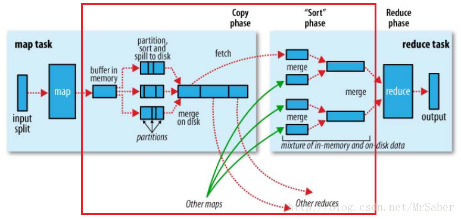

## 原理
  

### MapReduce由以下缺点： 
★ JobTracker挂掉，整个作业挂掉，存在单点故障  
★ JobTracker既负责资源管理又负责作业控制，当作业增多时，JobTracker内存是扩展的瓶颈  
★ map task全部完成后才能执行reduce task，造成资源空闲浪费  
YARN设计考虑以上缺点，对MapReduce重新设计：  
★ 将JobTracker职责分离，ResouceManager全局资源管理，ApplicationMaster管理作业的调度  
★ 对ResouceManager做了HA设计  
★ 设计了更细粒度的抽象资源容器Container  