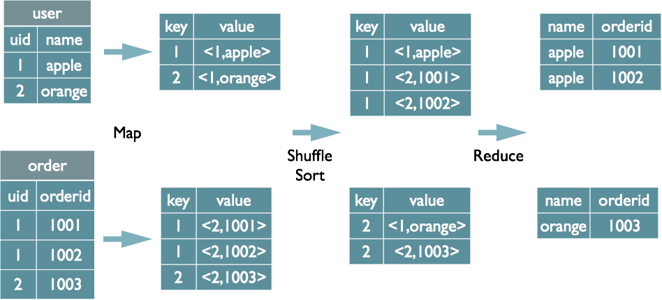
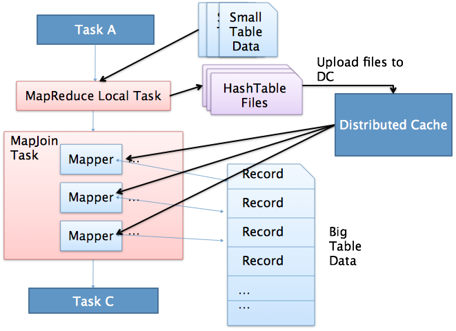
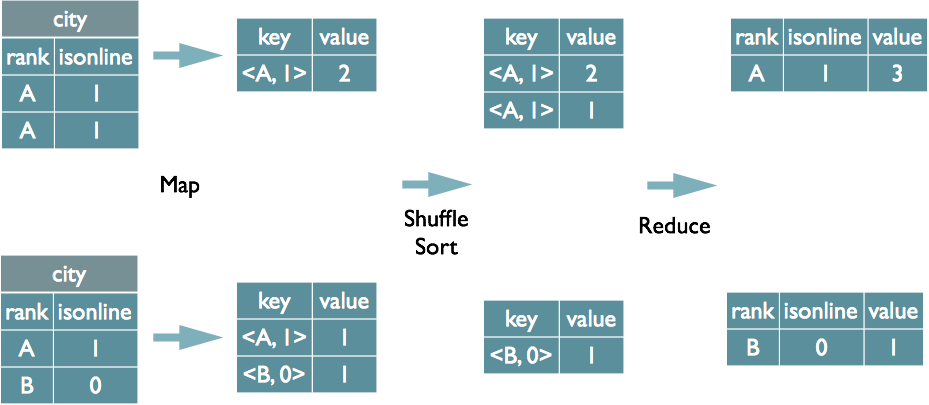

### spark任务执行流程  
&emsp; 我们使用spark-submit提交一个Spark作业之后，这个作业就会启动一个对应的Driver进程。根据你使用的部署模式（deploy-mode）不同，Driver进程可能在本地启动，也可能在集群中某个工作节点上启动。Driver进程本身会根据我们设置的参数，占有一定数量的内存和CPU core。而Driver进程要做的第一件事情，就是向集群管理器（可以是Spark Standalone集群，也可以是其他的资源管理集群，美团•大众点评使用的是YARN作为资源管理集群）申请运行Spark作业需要使用的资源，这里的资源指的就是Executor进程。YARN集群管理器会根据我们为Spark作业设置的资源参数，在各个工作节点上，启动一定数量的Executor进程，每个Executor进程都占有一定数量的内存和CPU core。  
&emsp; 在申请到了作业执行所需的资源之后，Driver进程就会开始调度和执行我们编写的作业代码了。Driver进程会将我们编写的Spark作业代码分拆为多个stage，每个stage执行一部分代码片段，并为每个stage创建一批task，然后将这些task分配到各个Executor进程中执行。task是最小的计算单元，负责执行一模一样的计算逻辑（也就是我们自己编写的某个代码片段），只是每个task处理的数据不同而已。一个stage的所有task都执行完毕之后，会在各个节点本地的磁盘文件中写入计算中间结果，然后Driver就会调度运行下一个stage。下一个stage的task的输入数据就是上一个stage输出的中间结果。如此循环往复，直到将我们自己编写的代码逻辑全部执行完，并且计算完所有的数据，得到我们想要的结果为止。  
&emsp; Spark是根据shuffle类算子来进行stage的划分。如果我们的代码中执行了某个shuffle类算子（比如reduceByKey、join等），那么就会在该算子处，划分出一个stage界限来。可以大致理解为，shuffle算子执行之前的代码会被划分为一个stage，shuffle算子执行以及之后的代码会被划分为下一个stage。因此一个stage刚开始执行的时候，它的每个task可能都会从上一个stage的task所在的节点，去通过网络传输拉取需要自己处理的所有key，然后对拉取到的所有相同的key使用我们自己编写的算子函数执行聚合操作（比如reduceByKey()算子接收的函数）。这个过程就是shuffle。  
&emsp; 当我们在代码中执行了cache/persist等持久化操作时，根据我们选择的持久化级别的不同，每个task计算出来的数据也会保存到Executor进程的内存或者所在节点的磁盘文件中。  
&emsp; 因此Executor的内存主要分为三块：第一块是让task执行我们自己编写的代码时使用，默认是占Executor总内存的20%；第二块是让task通过shuffle过程拉取了上一个stage的task的输出后，进行聚合等操作时使用，默认也是占Executor总内存的20%；第三块是让RDD持久化时使用，默认占Executor总内存的60%。  
&emsp; task的执行速度是跟每个Executor进程的CPU core数量有直接关系的。一个CPU core同一时间只能执行一个线程。而每个Executor进程上分配到的多个task，都是以每个task一条线程的方式，多线程并发运行的。如果CPU core数量比较充足，而且分配到的task数量比较合理，那么通常来说，可以比较快速和高效地执行完这些task线程。  
### spark 参数优化  
* num-executors  
* executor-memory  
* executor-cores  
* driver-memory  
* spark.default.parallelism:该参数为num-executors * executor-cores的2~3倍较为合适  
* spark.storage.memoryFraction  
* spark.shuffle.memoryFraction  
>
	./bin/spark-submit \
	  --master yarn-cluster \
	  --num-executors 100 \
	  --executor-memory 6G \
	  --executor-cores 4 \
	  --driver-memory 1G \
	  --conf spark.default.parallelism=1000 \
	  --conf spark.storage.memoryFraction=0.5 \
	  --conf spark.shuffle.memoryFraction=0.3 \
  
### spark 优化  
* 避免创建重复的rdd;尽可能复用同一个rdd；需要多次使用的rdd进行持久化：  
* 尽量避免使用shuffer类算子(将多个节点上的同一个key拉取到同一个节点进行聚合或者join操作)，例如：reduceByKey、join、distinct、repartition等；采用map端join操作避免shuffer等。    
&emsp; shuffle过程中，各个节点上的相同key都会先写入本地磁盘文件中，然后其他节点需要通过网络传输拉取各个节点上的磁盘文件中的相同key。而且相同key都拉取到同一个节点进行聚合操作时，还有可能会因为一个节点上处理的key过多，导致内存不够存放，进而溢写到磁盘文件中。因此在shuffle过程中，可能会发生大量的磁盘文件读写的IO操作，以及数据的网络传输操作。磁盘IO和网络数据传输也是shuffle性能较差的主要原因。  
* 使用map-side预聚合的shuffle操作，类似于MapReduce中的本地combiner。  
&emsp; 建议使用reduceByKey或者aggregateByKey算子来替代掉groupByKey算子。因为reduceByKey和aggregateByKey算子都会使用用户自定义的函数对每个节点本地的相同key进行预聚合。而groupByKey算子是不会进行预聚合的，全量的数据会在集群的各个节点之间分发和传输，性能相对来说比较差。  
* 使用高性能算子  
&emsp; 1. 使用reduceByKey/aggregateByKey替代groupByKey,使用map-side预聚合的shuffle操作”。  
&emsp; 2. 使用mapPartitions替代普通map：mapPartitions类的算子，一次函数调用会处理一个partition所有的数据，而不是一次函数调用处理一条，性能相对来说会高一些。但是有的时候，使用mapPartitions会出现OOM（内存溢出）的问题。因为单次函数调用就要处理掉一个partition所有的数据，如果内存不够，垃圾回收时是无法回收掉太多对象的，很可能出现OOM异常。所以使用这类操作时要慎重！  
&emsp; 3. 使用foreachPartitions替代foreach：原理类似于“使用mapPartitions替代map”，也是一次函数调用处理一个partition的所有数据，而不是一次函数调用处理一条数据。在实践中发现，foreachPartitions类的算子，对性能的提升还是很有帮助的。比如在foreach函数中，将RDD中所有数据写MySQL，那么如果是普通的foreach算子，就会一条数据一条数据地写，每次函数调用可能就会创建一个数据库连接，此时就势必会频繁地创建和销毁数据库连接，性能是非常低下；但是如果用foreachPartitions算子一次性处理一个partition的数据，那么对于每个partition，只要创建一个数据库连接即可，然后执行批量插入操作，此时性能是比较高的。实践中发现，对于1万条左右的数据量写MySQL，性能可以提升30%以上。  
&emsp; 4. 使用filter之后进行coalesce操作:通常对一个RDD执行filter算子过滤掉RDD中较多数据后（比如30%以上的数据），建议使用coalesce算子，手动减少RDD的partition数量，将RDD中的数据压缩到更少的partition中去。因为filter之后，RDD的每个partition中都会有很多数据被过滤掉，此时如果照常进行后续的计算，其实每个task处理的partition中的数据量并不是很多，有一点资源浪费，而且此时处理的task越多，可能速度反而越慢。因此用coalesce减少partition数量，将RDD中的数据压缩到更少的partition之后，只要使用更少的task即可处理完所有的partition。在某些场景下，对于性能的提升会有一定的帮助。  
&emsp; 5. 使用repartitionAndSortWithinPartitions替代repartition与sort类操作:repartitionAndSortWithinPartitions是Spark官网推荐的一个算子，官方建议，如果需要在repartition重分区之后，还要进行排序，建议直接使用repartitionAndSortWithinPartitions算子。因为该算子可以一边进行重分区的shuffle操作，一边进行排序。shuffle与sort两个操作同时进行，比先shuffle再sort来说，性能可能是要高的。  
* 广播大变量  
&emsp; 有时在开发过程中，会遇到需要在算子函数中使用外部变量的场景（尤其是大变量，比如100M以上的大集合），那么此时就应该使用Spark的广播（Broadcast）功能来提升性能。  
&emsp; 在算子函数中使用到外部变量时，默认情况下，Spark会将该变量复制多个副本，通过网络传输到task中，此时每个task都有一个变量副本。如果变量本身比较大的话（比如100M，甚至1G），那么大量的变量副本在网络中传输的性能开销，以及在各个节点的Executor中占用过多内存导致的频繁GC，都会极大地影响性能。  
&emsp; 因此对于上述情况，如果使用的外部变量比较大，建议使用Spark的广播功能，对该变量进行广播。广播后的变量，会保证每个Executor的内存中，只驻留一份变量副本，而Executor中的task执行时共享该Executor中的那份变量副本。这样的话，可以大大减少变量副本的数量，从而减少网络传输的性能开销，并减少对Executor内存的占用开销，降低GC的频率。  
* 使用Kryo优化序列化性能  
&emsp; 在Spark中，主要有三个地方涉及到了序列化： * 在算子函数中使用到外部变量时，该变量会被序列化后进行网络传输（见“原则七：广播大变量”中的讲解）。 * 将自定义的类型作为RDD的泛型类型时（比如JavaRDD，Student是自定义类型），所有自定义类型对象，都会进行序列化。因此这种情况下，也要求自定义的类必须实现Serializable接口。 * 使用可序列化的持久化策略时（比如MEMORY_ONLY_SER），Spark会将RDD中的每个partition都序列化成一个大的字节数组。  
&emsp; 对于这三种出现序列化的地方，我们都可以通过使用Kryo序列化类库，来优化序列化和反序列化的性能。Spark默认使用的是Java的序列化机制，也就是ObjectOutputStream/ObjectInputStream API来进行序列化和反序列化。但是Spark同时支持使用Kryo序列化库，Kryo序列化类库的性能比Java序列化类库的性能要高很多。官方介绍，Kryo序列化机制比Java序列化机制，性能高10倍左右。Spark之所以默认没有使用Kryo作为序列化类库，是因为Kryo要求最好要注册所有需要进行序列化的自定义类型，因此对于开发者来说，这种方式比较麻烦。  

&emsp; 一些常用的并且可能会触发shuffle操作的算子：distinct、groupByKey、reduceByKey、aggregateByKey、join、cogroup、repartition等  
### hive sql转化为mapreduce过程  
* 解析sql语法，将sql转化为抽象语法树；  
* 遍历抽象语法树，抽象出查询的基本组成单元QueryBlock；  
* 遍历QueryBlock，翻译为执行操作树OperatorTree  
* 优化执行操作树OperatorTree，合并不必要的ReduceSinkOperator，减少shuffer数量  
* 遍历OperatorTree，翻译为MapReduce任务  
* 物理层进行MapReduce任务变化，生成最终执行计划  

### spark join  
* MapJoin 通过broadcast将小表发送到每台执行节点上，关联操作在本地完成，取消shuffer过程。  

### hive join  
&emsp; 在map输出的value值中对不同表的数据打标记，然后在reduce表中通过标记进行join操作；    
  
* MapJoin优化  
&emsp; MapJoin简单说就是在Map阶段将小表读入内存，顺序扫描大表完成Join。map端join没有shuffer，可以设置set hive.auto.convert.join=true;让hive识别小表。  
  
1. 通过MapReduce Local Task，将小表读入内存，生成HashTableFiles上传至Distributed Cache中，这里会对HashTableFiles进行压缩。  
2. MapReduce Job在Map阶段，每个Mapper从Distributed Cache读取HashTableFiles到内存中，顺序扫描大表，在Map阶段直接进行Join，将数据传递给下一个MapReduce任务。  

* Common Join  
&emsp; common join也叫做shuffle join，reduce join操作。这种情况下生再两个table的大小相当，但是又不是很大的情况下使用的。具体流程就是在map端进行数据的切分，一个block对应一个map操作，然后进行shuffle操作，把对应的block shuffle到reduce端去，再逐个进行联合，这里可能会涉及到数据的倾斜。  

* SMB Join  
&emsp; smb是sort  merge bucket操作，首先进行排序，继而合并，然后放到所对应的bucket中去，bucket是hive中和分区表类似的技术，就是按照key进行hash，相同的hash值都放到相同的buck中去。在进行两个表联合的时候。我们首先进行分桶，在join会大幅度的对性能进行优化。也就是说，在进行联合的时候，是table1中的一小部分和table1中的一小部分进行联合，table联合都是等值连接，相同的key都放到了同一个bucket中去了，那么在联合的时候就会大幅度的减小无关项的扫描。  
### hive group by  
&emsp; 将GroupBy的字段组合为map输出的key值，  
  

### blog  
* spark 优化： https://tech.meituan.com/2016/04/29/spark-tuning-basic.html  
* spark 优化 数据倾斜: https://tech.meituan.com/2016/05/12/spark-tuning-pro.html  
