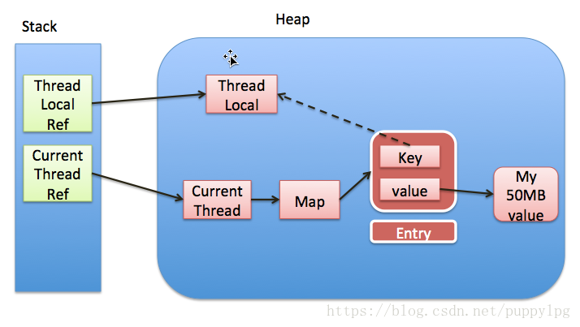

## ThreadLocal
  
&emsp; 每次get()/set()/remove()ThreadLocalMap中的值的时候，会自动清理key为null的value。如此一来，value也能被回收了。  

### set  
&emsp; 获取当前线程t，从t中获取线程的ThreadLocalMap，如果map为空则创建，否则将threadLocal和value作为key->value对放入map中。代码如下：  
	
	public void set(T value) {
        Thread t = Thread.currentThread();
        ThreadLocalMap map = getMap(t);
        if (map != null)
            map.set(this, value);
        else
            createMap(t, value);
    }
	
	//获取ThreadLocalMap
	ThreadLocalMap getMap(Thread t) {
        return t.threadLocals;
    }
	//ThreadLocalMap定义
	ThreadLocal.ThreadLocalMap threadLocals = null;
	
	//创建ThreadLocalMap
	void createMap(Thread t, T firstValue) {
        t.threadLocals = new ThreadLocalMap(this, firstValue);
    }
	
### ThreadLocalMap  
&emsp; ThreadLocalMap内部采用Entry数组实现，如果发生hash碰撞，则调用nextHashcode，继续向后寻找。直到找到需要插入的对象或者空对象。
如果找到了对应的key，则更新value值，否则生成Entry对象，并插入到map中。代码如下：  
	
	private void set(ThreadLocal<?> key, Object value) {
		Entry[] tab = table;
		int len = tab.length;
		int i = key.threadLocalHashCode & (len-1);

		//发生hash碰撞，通过调用nextIndex继续向后寻址。（未使用链表解决hash碰撞）
		for (Entry e = tab[i];
			 e != null;
			 e = tab[i = nextIndex(i, len)]) {
			ThreadLocal<?> k = e.get();

			if (k == key) {
				e.value = value;
				return;
			}

			if (k == null) {
				replaceStaleEntry(key, value, i);
				return;
			}
		}

		tab[i] = new Entry(key, value);
		int sz = ++size;
		if (!cleanSomeSlots(i, sz) && sz >= threshold)
			rehash();
	}
	
### Entry  
&emsp;TheadLocalMap中的Entry继承WeakReference，当Thread中将ThreadLocal的引用置为null后，ThreadLocal就会被gc回收。  

	static class Entry extends WeakReference<ThreadLocal<?>> {
		Object value;

		Entry(ThreadLocal<?> k, Object v) {
			super(k);
			value = v;
		}
	}
	
### 内存泄漏  
&emsp; ThreadLocal被回收后，ThreadLocalMap中ThreadLocal指向的value就无法被回收了。此处可能造成内存泄漏。  
* 在调用get、set、remove的时候都会调用rehash将map中key为空的Entry的value设置为空，则下次gc的时候value的内存就可以被回收。  
* ThreadLocal使用完成后，手动调用remove方法，删除对应的value值。  