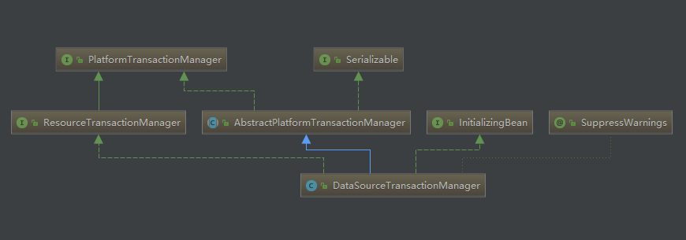

## 事务基础  
&emsp; Spring中的事务主要由PlatformTransactionManager、TransactionDefinition和TransactionStatus三个类中实现。以下代码以springframework-4.3.11.RELEASE为例进行说明。  

### PlatformTransactionManager
&emsp; 事务管理核心接口，定义了开启事务、提交事务和回滚事务的操作。PlatformTransactionManager的类继承图如下所示：
 

接口代码如下所示：

	public interface PlatformTransactionManager {
		//获取事务并开启事务
		TransactionStatus getTransaction(TransactionDefinition var1) throws TransactionException;
		//事务提交操作
		void commit(TransactionStatus var1) throws TransactionException;
		//事务回滚操作
		void rollback(TransactionStatus var1) throws TransactionException;
	}

### TransactionDefinition   
&emsp; 事务传播性和隔离级别，定义了不同事务之间如何执行。事务传播主要有三种情况：支持当前事务/不支持当前事务/嵌套事务。  

	public interface TransactionDefinition {
		//支持当前事务; 如果不存在，则创建一个新的
		int PROPAGATION_REQUIRED = 0;
		//支持当前事务; 如果不存在，则以非事务方式执行。
		int PROPAGATION_SUPPORTS = 1;
		//支持当前事务; 如果没有当前事务存在，则抛出异常。
		int PROPAGATION_MANDATORY = 2;
		//创建一个新的事务，如果存在，暂停当前事务。
		int PROPAGATION_REQUIRES_NEW = 3;
		//不支持当前事务; 而总是执行非事务性的。
		int PROPAGATION_NOT_SUPPORTED = 4;
		//不支持当前事务; 如果当前事务存在，则抛出异常
		int PROPAGATION_NEVER = 5;
		//如果当前事务存在，则在嵌套事务内执行
		int PROPAGATION_NESTED = 6;
		
		//事务隔离级别
		//默认级别，和具体的数据库设置有关，eg：mysql中是REPEATABLE_READ
		int ISOLATION_DEFAULT = -1;		
		//READ_UNCOMMITTED：可能出现脏读
		int ISOLATION_READ_UNCOMMITTED = 1;
		//READ_COMMITTED：可能出现不能重复读
		int ISOLATION_READ_COMMITTED = 2;
		//REPEATABLE_READ:可能出现幻读(MYSQL采用next-key lock和gap-lock保证在此隔离性下避免幻读出现)
		int ISOLATION_REPEATABLE_READ = 4;
		//序列化，表锁、单线程执行
		int ISOLATION_SERIALIZABLE = 8;
		//超时时间，配置文件里面设置。
		int TIMEOUT_DEFAULT = -1;

		int getPropagationBehavior();

		int getIsolationLevel();
		//事务超时时间
		int getTimeout();

		boolean isReadOnly();

		String getName();
	}

### TransactionStatus  
&emsp; 记录事务的状态。

	public interface TransactionStatus extends SavepointManager, Flushable {
		boolean isNewTransaction();

		boolean hasSavepoint();

		void setRollbackOnly();

		boolean isRollbackOnly();

		void flush();

		boolean isCompleted();
	}

## 事务配置  

### 开启事务  

	public final TransactionStatus getTransaction(TransactionDefinition definition) throws TransactionException {
		//获取事务对象，子类DataSourceTransactionManager实现。
        Object transaction = this.doGetTransaction();
        boolean debugEnabled = this.logger.isDebugEnabled();
		//生成TransactionDefinition，控制事务的传播性。主要包括：使用同一个事务，使用不同事务，嵌套事务等三种传播性。
        if (definition == null) {
            definition = new DefaultTransactionDefinition();
        }

        if (this.isExistingTransaction(transaction)) {
			//当前连接已经开启了事务
            return this.handleExistingTransaction((TransactionDefinition)definition, transaction, debugEnabled);
        } else if (((TransactionDefinition)definition).getTimeout() < -1) {
			//事务超时，返回
            throw new InvalidTimeoutException("Invalid transaction timeout", ((TransactionDefinition)definition).getTimeout());
        } else if (((TransactionDefinition)definition).getPropagationBehavior() == 2) {
			//如果设置了使用同一个事务，但是当前连接没有开启事务，则抛出异常。
            throw new IllegalTransactionStateException("No existing transaction found for transaction marked with propagation 'mandatory'");
        } else if (((TransactionDefinition)definition).getPropagationBehavior() != 0 && ((TransactionDefinition)definition).getPropagationBehavior() != 3 && ((TransactionDefinition)definition).getPropagationBehavior() != 6) {
            if (((TransactionDefinition)definition).getIsolationLevel() != -1 && this.logger.isWarnEnabled()) {
                this.logger.warn("Custom isolation level specified but no actual transaction initiated; isolation level will effectively be ignored: " + definition);
            }

            boolean newSynchronization = this.getTransactionSynchronization() == 0;
            return this.prepareTransactionStatus((TransactionDefinition)definition, (Object)null, true, newSynchronization, debugEnabled, (Object)null);
        } else {
            AbstractPlatformTransactionManager.SuspendedResourcesHolder suspendedResources = this.suspend((Object)null);
            if (debugEnabled) {
                this.logger.debug("Creating new transaction with name [" + ((TransactionDefinition)definition).getName() + "]: " + definition);
            }

            try {
                boolean newSynchronization = this.getTransactionSynchronization() != 2;
                DefaultTransactionStatus status = this.newTransactionStatus((TransactionDefinition)definition, transaction, true, newSynchronization, debugEnabled, suspendedResources);
                this.doBegin(transaction, (TransactionDefinition)definition);
                this.prepareSynchronization(status, (TransactionDefinition)definition);
                return status;
            } catch (RuntimeException var7) {
                this.resume((Object)null, suspendedResources);
                throw var7;
            } catch (Error var8) {
                this.resume((Object)null, suspendedResources);
                throw var8;
            }
        }
    }
	
	//DataSourceTransactionManager中的doGetTransaction实现
	protected Object doGetTransaction() {
		//创建事务对象，主要封装了当前连接和安全点
		DataSourceTransactionObject txObject = new DataSourceTransactionObject();
		//如果是嵌套事务，需要设置安全点，便于内部事务失败后可以控制回滚到安全点
		txObject.setSavepointAllowed(isNestedTransactionAllowed());
		//获取当前线程的数据库连接
		ConnectionHolder conHolder =
				(ConnectionHolder) TransactionSynchronizationManager.getResource(this.dataSource);
		//设置数据库连接
		txObject.setConnectionHolder(conHolder, false);
		return txObject;
	}